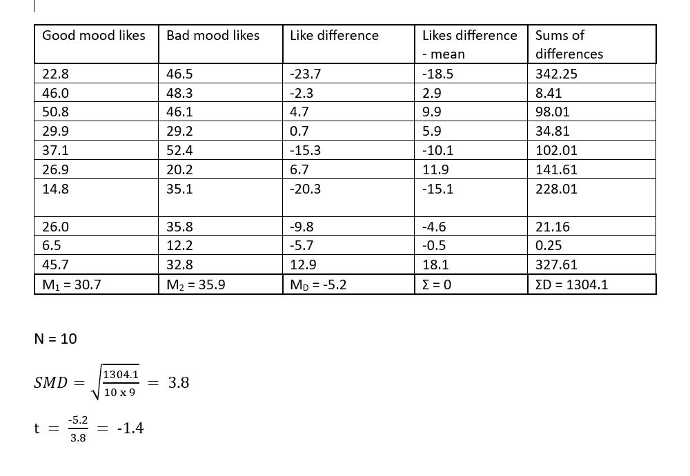

# Testing our first hypothesis {#sec-testing-first-hypothesis}

Today we are going to ask our first question and seek an answer from the data. We will get the data into shape so that it is in the right format for visualizing and analysing. Then we will run the analysis and learn the answer to our question. Welcome. You are now a psychologist :)


## Checking installation and loading packages

As usual we first always check and load in our required packages. Amend the code in
your script so that it matches the code below. Then make sure it runs just fine.

```{r message = FALSE, warning= FALSE}
# Check if packages are installed, if not install.
if(!require(here)) install.packages('here') #checks if a package is installed and installs it if required.
if(!require(tidyverse)) install.packages('tidyverse')

library(here) #loads in the specified package
library(tidyverse)
```


## Developing our hypotheses

Today we are going to address one of the key questions of the study about social media use – **how does mood influence active social media use?** Active social media use involves interacting with content (i.e. liking posts) rather than just observing posts.

There is some evidence to suggest that passive social media use is associated with lower mood in adolescents, whereas active social media use is related to positive mood [Dienlin & Johannes, 2020](https://pmc.ncbi.nlm.nih.gov/articles/PMC7366938/). However, a lot of the existing evidence comes from self-report, rather than measuring social media behaviour directly.

To address this question, the researchers used the participants' metadata to count how frequently they liked posts. By cross-referencing this with the mood diary kept by each participant, they were able to calculate the average number of likes per 10 minutes of use when participants were in a good mood, and when they were in a bad mood.

Hopefully it's clear by now that we will be addressing this question using the `good_mood_likes` and `bad_mood_likes` varaibles.  Remember, these variables stand for the following:

-   `good_mood_likes` – average number of likes made over 10 min during a good mood (from platform + diary)
-   `bad_mood_likes` – as above, but during bad mood

But you should know this, because you read the README.txt file already, right? :)


### Activity - Defining our hypotheses

Based on the information above, discuss and formulate hypotheses around the following:

1. Should there be a difference in the number of likes between the mood conditions?
2. What direction do you think this difference could be? Can you formulate an experimental hypothesis each way – i.e. good mood likes > bad mood likes, and vice versa?
3. What is the null hypothesis?

::: {style="border-left: 4px solid #9C27B0; background-color: #F3E5F5; padding: 10px; margin: 10px 0;"}
<strong>Question:</strong> Discuss this with your neighbour and your tutor. Make sure you have clearly defined your hypotheses before moving forward.
:::

## Visualising our data

We may have mentioned before that it's incredibly important to visualize your data before running any statistical tests. This is because visualizing your data can help you understand the underlying distribution of the data, identify any potential outliers or anomalies, and ensure that the assumptions of the statistical test you plan to use are met. Remember, it protects against "garbage in, garbage out"!

### Activity - Loading in the data

Last lab we were very smart and saved the cleaned version of the data as a new CSV file. This is what we will be using today. We put it in the Data folder for you already. Use the Files pane to check.

First step! Let's load the dataset `PSYC2001_social-media-data-cleaned.csv`.  To do this we use the same `read.csv()` function combined with `here()`. Do you remember how to do this?

Complete the following line of code in your script. Again, we have been cheeky and have left a little bit out. But you should be able to work it out. You can also refer back to Section \@ref(sec-import-data) if you need to.

```{r, eval=FALSE }
social_media <- read.csv(file = here(???,"PSYC2001_social-media-data-cleaned.csv")) #reads in CSV files
```

```{r, message=FALSE, echo=FALSE, results='hide'}

social_media <- read.csv(file = here("Data","PSYC2001_social-media-data-cleaned.csv"))
```

Now, we did save the data ourselves last week, so we know it is clean. But just to be sure, amend your script so you can get a summary of the data using the `summary()` function. You can check that the -999s are no longer there.
If you don't remember how to do this, then you can check what happened in Section \@ref(sec-data-view).

## Visualising is important

Before we conduct any kind of statistical test it is a good idea to see how it looks. This will give us an understanding about the underlying data that is driving the results of our statistical test. 

::: {style="border-left: 4px solid #FF9800; background-color: #FFF3E0; padding: 10px; margin: 10px 0;"}
<strong>Warning:</strong> It is generally **bad practice** to go straight from the raw data to the results of a statistical test without first visualising the data.
:::


```{r, echo=FALSE, out.width="50%", fig.align='center', fig.cap="Professors' reaction when you don't visualise data"}
knitr::include_graphics("images/Testing_our_first_hypothesis/Statistics_professors_reaction.gif")
```


## Density plots are useful (and pretty)

One great way to look at the distribution of your variables is by using a density plot. A density plot is a smoothed version of a histogram which allows us to understand what the full distribution might look like if we had all the data in the world. More information on that [is here](https://www.data-to-viz.com/graph/density.html) if you are interested.

In order to make plotting easy we first have to wrangle our data a bit. Remember, data analysis is 90% wrangling, 10% analysis! What we want to do here is convert our data from wideform (which is more digestible for us mere humans) into longform format (which programs like R generally like more). You can read more on that [here](https://www.statology.org/long-vs-wide-data/), but to make it simple, we just need to get the key variables from our dataframe object that currently look like this:

**Wideform data**
```{r, wide, echo=FALSE}

head(social_media %>% select(id, good_mood_likes, bad_mood_likes))

```

And convert it into longform so that it looks like this:

**Longform data**
```{r, long, echo=FALSE}

head(social_media %>% select(id, good_mood_likes, bad_mood_likes) %>%
  pivot_longer(cols = ends_with("likes"), names_to = "mood", values_to = "likes"))
```

As you can see, instead of having each subject's good and bad mood likes in separate columns, we now have a single column for likes and a second column which indicates whether the likes were made in a good or bad mood. So each subject now has two rows in the dataset. This makes it much easier to plot, and to do many other things!

::: {style="border-left: 4px solid #046324; background-color: #9ff5bc; padding: 10px; margin: 10px 0;"}
<strong>Helpful fact</strong> You may notice that the printout of the longform data has a few extra details, compared to the wideform data. The longform data is called 'A tibble' which is a special type of dataframe that comes from the `tidyverse` package. It basically means that you used the tidyverse to make a new dataframe, and the tidyverse package turned it into a tibble for you. Tibbles have a few extra features that make them easier to work with, but they are still dataframes at their core.
:::

### Activity - Get back on the pipes! {#sec-get-back-on-the-pipes}

Its time to get back on the pipes! We get our data into longform by taking the following steps:  

- First we use the `select()` function to easily choose which columns we do (or don't) want to keep in our dataframe. Here we keep only the columns "id", "good_mood_likes" and "bad_mood_likes".

Run the following code in your script so you can see what the select function does. Note that we are not saving this as a new object, so it will just print to the console. **Handy hint: this is a great way to check what each function does!**

```{r, try_select, eval=FALSE}

social_media %>% 
  select("id","good_mood_likes","bad_mood_likes") # choose which columns we want keep in our dataframe

```

Bonus exercise! Try adding one more column from the dataframe to the `select()` function. For example, try adding the `age` column. Doing simple tests like this is a great way to check a function is really, really doing what you think.

Once you've done that, remove the extra column you added so that the code matches the code above.

Now that we have the columns we want to work with, we use the `pivot_longer()` function. This function will do all the heavy lifting turning our data from wideform to longform. Phew!  

This is how the using the `pivot_longer` function looks.

```{r Pivoting_data, eval=FALSE}

social_media %>% 
  select("id","good_mood_likes","bad_mood_likes") %>% # choose which columns we want keep in our dataframe
  pivot_longer(cols = ends_with("likes"), names_to = "mood", values_to = "likes") #take columns ending with "likes" and move the column names into "mood" and column values into "likes"

```

```{r Pivoting_data_for real, message=FALSE, echo=FALSE, results='hide'}

social_media_likes  <- social_media %>% 
  select("id","good_mood_likes","bad_mood_likes") %>% # choose which columns we want keep in our dataframe
  pivot_longer(cols = ends_with("likes"), names_to = "mood", values_to = "likes") #take columns ending with "likes" and move the column names into "mood" and column values into "likes"

```

The `pivot_longer()` function takes three important arguments.  

- The `cols` argument tells R which columns contain the key variables that we need to turn into longform. Here we use the `ends_with()` function to tell R to take all columns which end with "likes", nifty!   
- The `names_to` argument tells R what to call the new column which will contain the names of the columns we are pivoting (i.e good or bad mood). Here we call this new column "mood", as this is a good title for a column that will list whether the data were recorded when someone was either in a "good mood" or a "bad mood".  
- The `values_to` argument tells R what to call the new column which will contain the values from the columns we are pivoting (i.e the rate of likes). Here we call this new column "likes", because, erm, it contains the rate of likes.  

Highlight and run this code in your script to see the work of pivot_longer!

**Now, very important, save the results of your nifty coding work to a new dataframe so that you can 
do impressive things to the results, like making density plots!** Amend the above code in your 
script so that your dataframe is saved to an object called `social_media_likes`. Then run the code to create the new dataframe.

Let's make sure that this data still looks okay by using the `head()` function. Complete the code in your script so that it looks exactly like below, and run it to check the result is the same as you see here.

```{r View_of_the_data}
head(social_media_likes)
```


Et voila!

### Activity - start plotting

Now, we can have done the wrangling (90%), we can get onto visualising and analysis!

We get a density plot in R by using the `geom_density` function with `ggplot()`.

To do this, we need to add a bit more information to the `ggplot()` function, compared to when
we created a boxplot in Section \@ref(sec-make-bp). 

To make a density plot we need to tell it what variable we want to plot on the x-axis (likes), and we also want to tell it to use different density plots with different colours for the different moods. We tell `ggplot()` these things by calling the `aes()` function. You can think of `aes()` as setting the **aesthetics** of the plot. We tell `aes()` that we want to `group` the data by mood, and to `fill` in the density plots with different colours, depending on which mood is being plotted.

Run the below code in your script to see what happens.

```{r, ugly density, message = FALSE}

social_media_likes %>% 
  ggplot(aes(x = likes, group = mood, fill = mood)) + # set the aesthetics that will be worked 
  # with on the canvas
  geom_density() # use the data to draw a density plot 

```

So...this is OK. But some things are left to be desired. It would be nice if good_mood_likes didn't occlude bad_mood_likes, because we want to see how both distributions look.

Amend your code so that the density plots are semi-transparent. You can do this by adding an `alpha` argument inside the `geom_density()` function. You can think of `alpha` as a value that tells you how transparent something should be. Set `alpha = 0.5` to make the plots 50% transparent. Make your code match what you see below and run it to get the sweet results.

```{r semi-transparent density, message = FALSE}

social_media_likes %>% 
  ggplot(aes(x = likes, group = mood, fill = mood)) + # set the aesthetics that will be worked 
  # with on the canvas
  geom_density(alpha=0.5) # use the data to draw a density plot and make it 50% transparent

```

Ahhh, that's better! Then the last step, if you are striving for data viz beauty, is to add the classic theme (or [another](https://ggplot2.tidyverse.org/reference/ggtheme.html), if that's your jam) to your code. For example:

```{r Create a density plot, message = FALSE}

social_media_likes %>% 
ggplot(aes(x = likes, group = mood, fill = mood)) +
  geom_density(alpha=0.5) +
  theme_classic() #themes can be provided to ggplot which give it a bunch of aesthetics to change. One of these is theme_classic
```


### Activity - So you've visualised your data, now what? {#sec-visualised-now-what}

Great, we've visualised the data! So, now what? I hear you cry?

We visualised the data so we could check the following things before running our statistical test:  
- are the distributions of likes in each mood roughly normal?
- are there any obvious outliers that might affect the results of our statistical test?

What do you think? You can discuss this with your neighbour and tutor.

## Descriptive statistics

Before we can move onto conducting t-tests, the next step is to understand the descriptive statistics. For the data we are looking at **the most relevant descriptive statistics are the mean and standard deviation**. This is because we want to conduct a t-test to compare the average likes in different moods. The t-test asks if the difference between the means is larger than we would expect by chance, given the variability in the data (i.e. the standard deviation). That's why we need to know the mean and standard deviation of likes in each mood.

Tidyverse to the rescue! We can easily get this information in R by using the  `summarise()` function. The summarise function will take a dataframe and calculate summary statistics for it, and we get to define what summary statistics we want. The power!

Because we want to know the mean and standard deviation of likes in each mood, we need to use the `group_by()` function to tell R to split the data by mood first. 

### Activity - get descriptive! {#sec-get-descriptive}

Amend the following code in your script so that it matches what you see below. Then run it to get the mean and standard deviation of likes in each mood. 

```{r}

social_media_likes %>% 
  group_by(mood) %>% #split the data by mood
  summarise(mean = mean(likes),
            sd = sd(likes)) #calculate the mean number of likes

```

We can also save this as a new dataframe if we want to use it later. Amend your code so that the results are saved to a new dataframe object called `social_media_descriptives`. Then run the code to create the new dataframe.

::: {style="border-left: 4px solid #9C27B0; background-color: #F3E5F5; padding: 10px; margin: 10px 0;"}
<strong>Question:</strong> What are the mean number of likes in each different mood? What is the standard deviation? How do they compare to what you expected when you made your hypotheses?
:::

## Testing hypotheses manually

Now that we have had a look at the structure and descriptives statistics of our data we can have a go at using a t-test to compare the number of likes participants made in a good and bad mood. We could of course do this manually, by hand (as we have in the statistics tutorials). We have shown this below using the first 10 values for good and bad mood likes. 

```{r, echo=FALSE, out.width="75%", fig.align='center', fig.cap="t-test table"}

```

Thankfully, we have long since past the stone (pen) age so it is no longer necessary to do this by hand. We can get computers to do this for us! 

```{r, echo=FALSE, out.width="50%", fig.align='center', fig.cap="Handwritten statistiscs be like"}
knitr::include_graphics("images/Testing_our_first_hypothesis/Space_odyssey.gif")
```

## Testing hypothesis using a paired-sample t-test

We can very easily calculate a t-test with R using the `t.test()` function which comes as part of `baseR`. Please first have a look at the help for this function using the `?` syntax, much as you did in Section \@ref(sec-get-help). We recommend you type your request for t.test help info directly into the console. You should now see some helpful in the Help pane.

```{r, echo=FALSE, out.width="80%", fig.align='center', fig.cap="Handy t-test help"}
knitr::include_graphics("images/Testing_our_first_hypothesis/t-test_help.png")
```

We can see that `t.test()` takes different arguments which are important for the way it handles the data. What values you provide to these arguments is dependent on what kind of test you want to conduct. 

### Activity - Conducting a paired t-test {#sec-conducting-paired-t-test}

We are going to go through the arguments we need to perform a paired sample t-test. We can see from the help info that we should input a set of data values to an argument called `x` and another set of data values to an argument called `y`. You can think of `x` and `y` as stand-in names for the two variables we want to compare, which are `good_mood_likes` and `bad_mood_likes`.

Now the `t.test` function is from base R, and now you get to meet one of the peculiarities of base R. The `x` and `y` arguments expect your data to be in wideform format --But we did all that work getting it into longform, I hear you cry-- Yes, we did. But remember, that allowed us to easily compute descriptive statistics and visualise the data. 

Luckily for us, we also have the original wideform data saved in the `social_media` dataframe. So we will use that to compute our t-test. To do that, we need to know about a magical operator in R which is `$`. The `$` operator allows us to access specific columns in a dataframe. For example, if we wanted to access the `good_mood_likes` column in the `social_media` dataframe, we would use `social_media$good_mood_likes`. This tells R to look in the `social_media` dataframe and get the stuff that lives in the column called `good_mood_likes`.

Complete the line in your script so that it matches below, and then run it to see what happens.

```{r, use-the-dollar-sign, eval=FALSE}

social_media$good_mood_likes #access the good_mood_likes column in the social_media dataframe
```

You should see all the numbers from the good_mood_likes column, printed to the dataframe. That's exactly what the `t.test()` function needs to see to do its work.

Complete the code in your script so that it matches what you see below. But don't run it yet! There are some more things we need to tell `t.test()` before we can get it to do what we want.

```{r x_and_y, eval=FALSE}

t.test(x=social_media$good_mood_likes, #the x argument gets the good_mood_likes data
       y=social_media$bad_mood_likes) #the y argument gets the bad_mood_likes data
```

Now there is one more argument that we super care about setting when performing a t test. This is the `paired` argument. The `paired` argument tells R whether the two sets of data we are comparing are dependent (e.g. from the same people) or independent (e.g. from different people). We refer to dependent observations as "paired". Here, we know that the good and bad mood likes are from the same people, so we need to set `paired = TRUE`. If we were comparing likes from two different groups of people, we would set `paired = FALSE`.

Update the code in your script so that it exactly matches the below. Run it and check the output is the same as what we have here.

```{r paired_t-test}

t.test(x=social_media$good_mood_likes, #the x argument gets the good_mood_likes data
       y=social_media$bad_mood_likes, #the y argument gets the bad_mood_likes data
       paired = TRUE) #tell R that the data are paired (i.e. from the same people)
```

Now we have some answers! Use your new found knowledge of t-tests to interpret the output. What does it tell you? Does it refute the null hypothesis? Does it support what you thought? **Discuss the output with your tutor and neighbour.**

## Bonus Activity - One-sample t-tests

If you have cracked all the activities above, well done, you are coding like a fiend. Time for bonus knowledge.

Now that we have the output of a paired t-test we can compare it to a one sample t-test. The results of both of these tests should be identical (this has been covered in the lectures). For those that haven't attended the lectures, a) attend the lectures because if not you will miss out on so much more knowledge, and b) this is because a paired t-test is basically a one-sample t-test of matched difference scores ([more on that here](https://statisticsbyjim.com/hypothesis-testing/t-tests-1-sample-2-sample-paired-t-tests/))

Let's conduct a one-sample t-test of the difference scores between good and bad mood likes. 

First you will need to use the `mutate()` function on the original `social_media` dataframe to create a difference score column. Run this code in your script to see what happens. This will show you the `mutate()` function in action.

```{r mutate to create difference scores, eval=FALSE}

social_media %>% 
  mutate(likes_diff = good_mood_likes - bad_mood_likes) #create a new column which is the difference between
# good and bad mood likes
```


```{r show difference scores, echo=FALSE}

head(social_media %>% 
  mutate(likes_diff = good_mood_likes - bad_mood_likes)) #create a new column which is the difference between
# good and bad mood likes
```


```{r save difference scores, echo=FALSE, results='hide'}

social_media_diff <- social_media %>% 
  mutate(likes_diff = good_mood_likes - bad_mood_likes) #create a new column which is the difference between
# good and bad mood likes
```

Now, we're going to need to save that dataframe to an object called social_media_diff, so that we can use it in the
`t.test()` function. Update the code you just ran so that it starts with `social_media_diff <-` and run it to save the dataframe.

Now that we have correctly calculated and saved our difference score we can use the `t.test()` function to perform our one-sample t.test. Run this code in your script, and compare the output to the output of the paired t-test you did earlier. Are they the same?

::: {style="border-left: 4px solid #9C27B0; background-color: #F3E5F5; padding: 10px; margin: 10px 0;"}
<strong>Question:</strong> Compare the output of the one-sample t-test and the paired t-test. Are they the same?
:::


```{r onduct a one-sample t-test}

t.test(x=social_media_diff$likes_diff) # putting in only an x argument makes this a one-sample t-test
```


Ahhhh, its so beautiful when you get consistent results!

## You are Free!

Well done you have finished for this week! Once you finish, please confirm with your tutor that you understand all the things.

```{r, echo=FALSE, out.width="50%", fig.align='center', fig.cap="Students leaving evil statistics classes"}
knitr::include_graphics("images/Testing_our_first_hypothesis/Students_leaving.gif")
```


