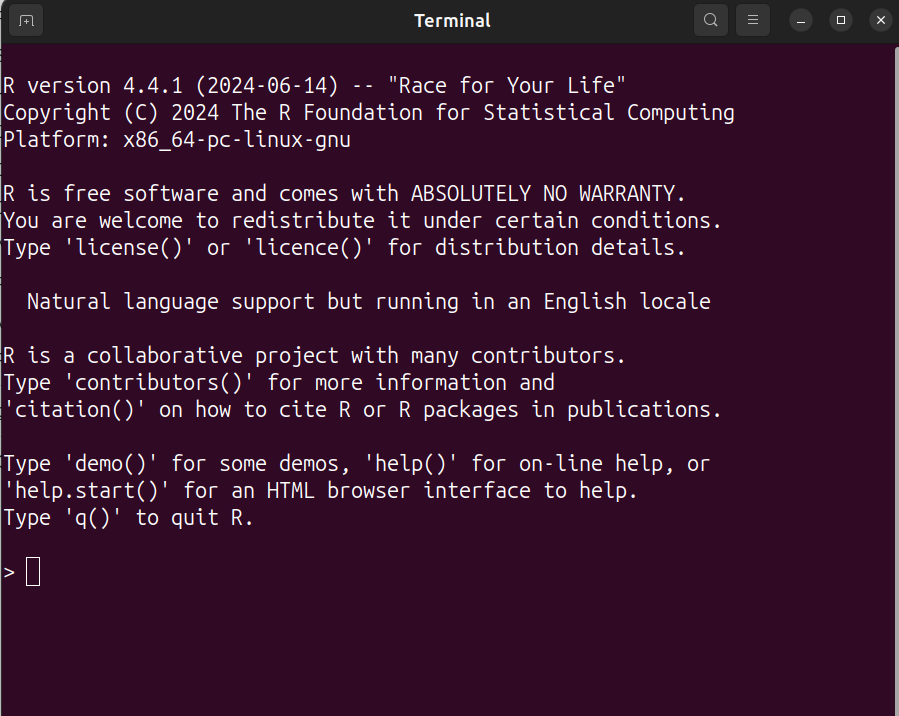
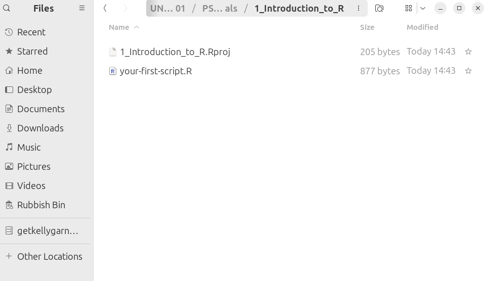
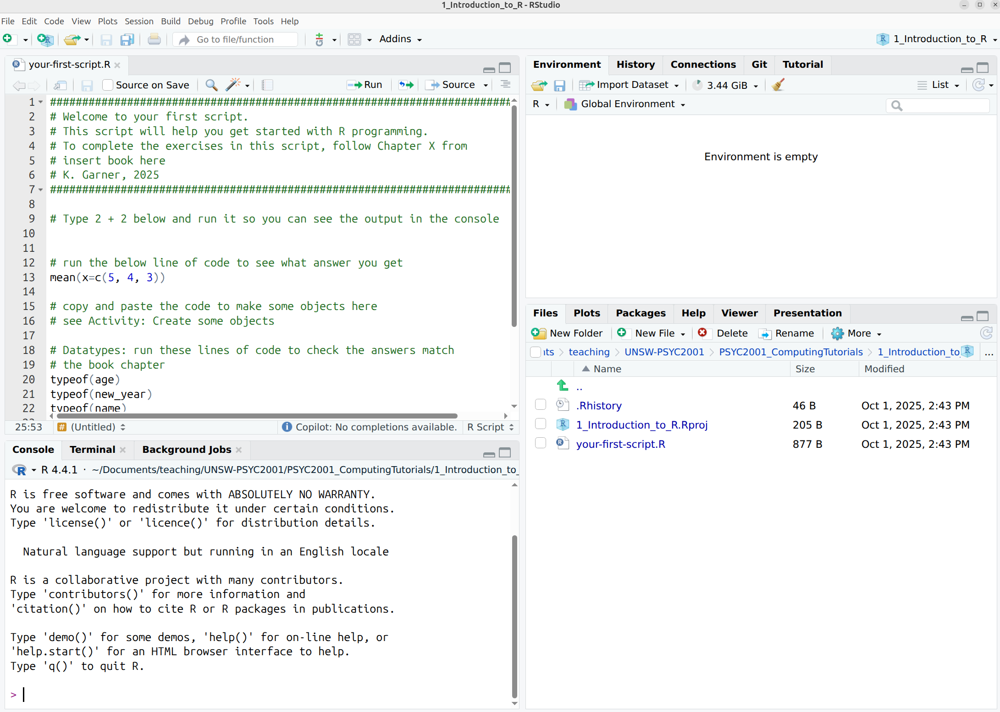
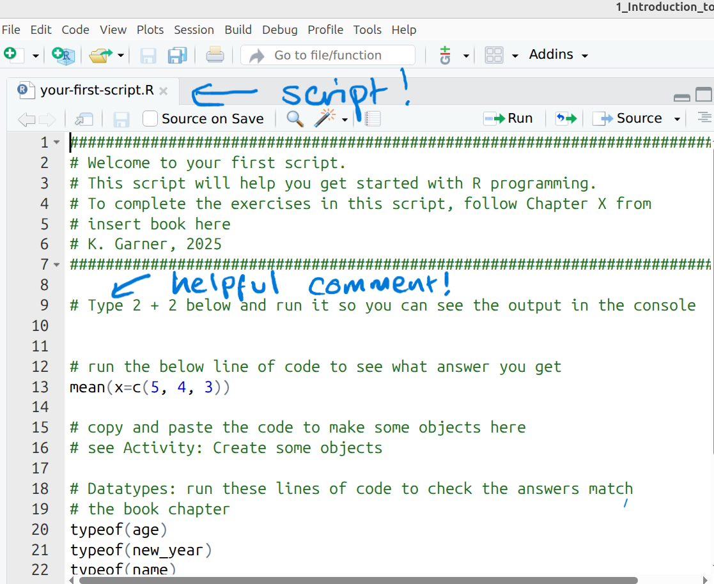
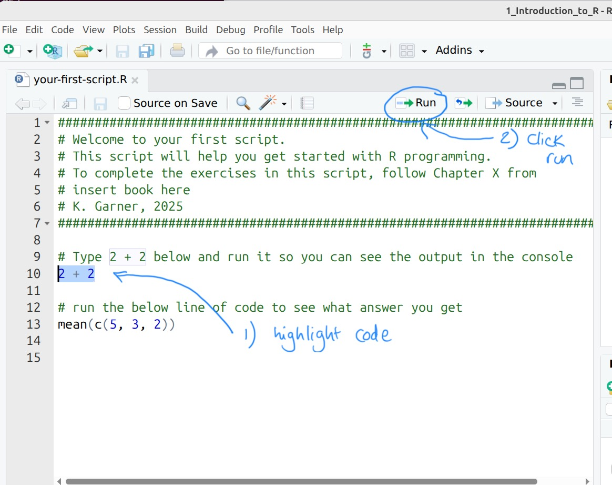
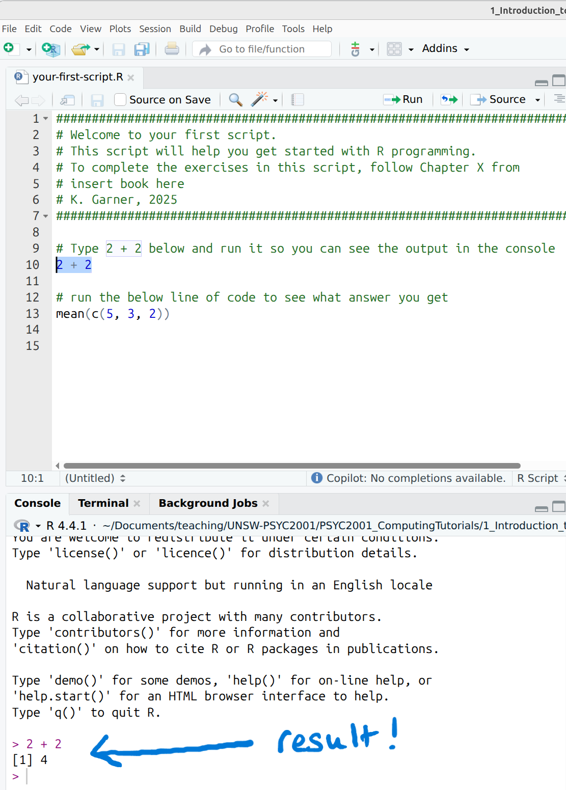

# Introduction to R 

::: {style="border-left: 4px solid #00bfa5; background-color: #e0f2f1; padding: 10px; margin: 10px 0;"}
<strong>Credit:</strong> This chapter heavily borrows from the work of Emily Nordmann at the University of Glasgow. Thanks, Emily!
https://psyteachr.github.io/ads-v3/01-intro.html
:::

To perform data analysis in Psychology, one needs some powerful software to help you get data into shape, and to apply all the fancy statistical tests that you will learn about in this course. In this course, we will be using the programming language R and the software R Studio to do this.

## R and R Studio

For this course, you need two different bits of software, [R](https://www.r-project.org/) and [RStudio](https://www.rstudio.com/products/rstudio/download/#download). R is a programming language that you will write code in and R Studio is an Integrated Development Environment (IDE) which makes working with R easier. Think of it as knowing English and using a plain text editor like NotePad to write a book versus using a word processor like Microsoft Word. You could do it, but it wouldn't look as good and it would be much harder without things like spell-checking and formatting. 


In a similar way, you can use R without R Studio but we wouldn't recommend it. The key thing to remember is that although you will do all of your work using R Studio for this course, you are actually using two pieces of software which means that from time-to-time, both of them may have separate updates.

```{r baseR, out.width='70%', fig.cap='This is what using R without RStudio looks like. Noone wants that.', echo=FALSE, fig.align='center'}

```


## Getting started

You should have downloaded the files you need for this week's computing lab tutorial from the course Moodle. Unzip the folder you have downloaded, move the folder somewhere sensible, e.g. from 'Downloads' to 'Documents'. Ask your tutor if you are unsure about any of those steps. 

Once the folder is unzipped and moved, open it up to take a peek at the contents inside. You should see something like the following -

```{r folder, out.width='70%', fig.cap='Every lab folder will contain the files you need for the session, and sometimes folders with extra things in them', echo=FALSE, fig.align='center'}

```

Each week you will get a folder that looks somewhat like this. Each week, your first job is to download the folder, unzip it and move it to your sensible location, and then double click on the file that ends in '.Rproj'. This will open RStudio.

::: {style="border-left: 4px solid #9d03fc; background-color: #ede0f2; padding: 10px; margin: 10px 0;"}
<strong>Why should I open RStudio by clicking on the '.Rproj' file?</strong> Indeed, this may seem like a strange request. .Rproj files automatically tells R where your files are located. This is called 'setting the working directory'. What this means is that you won't have to manually tell R where on the computer your needed files live (why will become clearer next week). This also means you get to save a lot of typing in future computing lab tutorials.
:::

## Getting to know R Studio

R Studio has a console that you can try out code in (appearing as the bottom left window in Figure \@ref(fig:img-rstudio). If you have opened a script, then there is a script editor (top left, more on scripts shortly below). There is also a window showing functions and objects you have created in the “Environment” tab (top right window in the figure), and a window that shows files, plots, packages, and help documentation (bottom right).

```{r img-rstudio, echo=FALSE, fig.align='center', fig.cap="The RStudio interface: ah, that's better!", echo=FALSE, fig.align='center'}



```

### Activity - using the console

First let's get used to the console where you can try out code. You can think of the console as a very fancy calculator. You can do some impressive calculations, but like a calculator, once you close it down, everything you did is lost.

Click on the Console (anywhere), and type the following:

```{r console, eval=FALSE}

2 + 2

```

Then press enter. You should see that R has calculated the answer for you. 

You can try other calculations, for example (you should also do this one): 

```{r console2, eval=FALSE}

(5 + 4 + 3) / 3

```

Important! If you are ever unsure about what a piece of code is doing, you should try running it (or bits of it) in the console, to see what answers each bit of code gives you. This is a great way to learn what code does and to debug your own code when it doesn't work.

## Scripts 

The console is great for small calculations and testing code, but it isn't very good for doing analyses that you want to keep. For this, we use scripts. A script is simply a text file that contains code. You know you have an R script when the filename ends in '.R'. You can write code in a script and then run it in the console. This means that you can save your code and come back to it later. It also means that anyone, anywhere else in the world can reproduce your analysis by running your script. This is a key part of open science and reproducible research.

### Activity - Getting to know scripts

* Open the script `your-first-script.R` in R Studio. You can do this by clicking on the file in the Files tab (bottom right window) or by using File > Open File... from the top menu.

You can see at the top of the script there are some comments. Comments are lines of text that start with a `#` symbol. R ignores these lines when it runs the code, but they are useful for you to write notes to yourself about what the code is doing. You should always include comments in your code to explain what it is doing. This helps you remember what you did when you come back to it later, and it helps others understand your code if you share it with them.

```{r img-scripts, echo=FALSE, fig.align='center', fig.cap="Scripts can run your code as many times as you please.", echo=FALSE, fig.align='center'}



```

* Try typing `2 + 2` into the script, below the comment that says <span style="color:#228B22"># Type 2 + 2 here</span>. 

* Now try running that bit of code in the script. You can do this by highlighting the line(s) of code you want to run and then clicking the 'Run' button at the top of the script window (see Figure 1: Run button). You should see that the answer appears in the console.

```{r img-highlightcode, echo=FALSE, fig.align='center', fig.cap="Highlight your code and then run it.", echo=FALSE, fig.align='center'}



```

::: {style="border-left: 4px solid #030ffc; background-color: #a4d3f5; padding: 10px; margin: 10px 0;"}
<strong>Important life hack!</strong> Another way to do this is to highlight the code you want to run and then press `Ctrl + Enter` (or `Cmd + Enter` on a Mac). Try this now.
:::

You should now see the result in the console. 

```{r img-result, echo=FALSE, fig.align='center', fig.cap="We all want results.", echo=FALSE}



```

* Remember to save your script regularly by clicking the save icon (or using `Ctrl + S` or `Cmd + S` on a Mac). Save it, save it now!

## Functions and arguments {#sec-get-help}

**Functions** in R allow you to perform tasks that would take a long time to write out by hand, by only using one word! Think of them as nifty tools that will save you lots of typing, again and again. A function normally takes a number of **arguments**. You can look up all the arguments that a function takes by using the help documentation. You get help by using the format `?function`. 

Before, we calculated `(5 + 4 + 3) / 3` in the console. You may have noticed that we add three numbers and then divide by the total number of numbers we have. You may have also noticed that this is the formula for calculating the mean (or average) of a set of numbers.

Often in Psychology, we want to calculate the mean when we have many more than three numbers. This is where functions come in handy. Let's look at the function `mean()`.

### Activity - using a function

* Look up the help documentation for `mean()` by typing `?mean` in the console. You will see that there is a **Description** of the function, a guide to it's **Usage**, and the **Arguments** you need to make the function work.

In the **Usage** section, we see that `mean()` takes the following form:

```{r arguments, eval = FALSE}

## Default S3 method:
mean(x, trim = 0, na.rm = FALSE, ...)
```

In the **Arguments** section, there are explanations for each of the arguments. `x` is the set of numbers that we want to calculate the mean for. Do not worry about `trim` and `na.rm`. For now, they can remain as mythical arguments in the interest of simplicity.

* Let's use the `mean` function. Highlight the following line of code in your script and run it:

```{r mean_exercise, eval=FALSE}

# run the below line of code to see what answer you get
mean(x=c(5, 4, 3))

```

The output in the console should match the answer you got when you calculated (5 + 4 + 3) / 3 by hand. This is but a simple example, but I am sure you can imagine the power of functions when you have many more numbers to work with.

You'll see in the code above that we have put the numbers together in some brackets preceded by the letter c `c()`. This is another function that combines the numbers into something called a vector. You can think of a vector as a list of items of the same type (e.g., all numbers, or all words). We will learn more about vectors later in this course.

::: {style="border-left: 4px solid #2196F3; background-color: #9cd5ff; padding: 10px; margin: 10px 0;"}
<strong>Getting help on help</strong> It can be difficult to understand help documentation when you are first learning R. Know that you will not be the first. Many cries for help have been posted on stackoverflow.com. You can look there. Also, asking AI like ChatGPT can be useful. For example, you could ask "What does the mean() function in R do?" and it will give you a plain English explanation. However, be careful as AI can sometimes give incorrect information. Always double-check with the official help documentation or other reliable sources. And always always always triple check any code you get AI to help you write.
:::

### Argument names

In the above example, we wrote out the argument name when using the mean (i.e., `x`), however, this is not strictly necessary. The following two lines of code would both produce the same result:

```{r argument-names, eval = FALSE}

mean(x=c(5, 4, 3))
mean(c(5, 4, 3))

```

Importantly, if you do not write out the argument names, R will use the default order of arguments, so, health warning, make sure you check the order when there is more than 1 argument!

If you write out the argument names then you can write the arguments in whatever order you like:

```{r argument-order, eval = FALSE}

mean(trim=0, x=c(5, 4, 3), na.rm=FALSE)

```

When you are first learning R, you may find it useful to write out the argument names as it can help you remember and understand what each part of the function is doing. However, as your skills progress you may find it quicker to omit the argument names and you will also see examples of code online that do not use argument names so it is important to be able to understand which argument each argument is referring to (or look up the help documentation to check).

In this course, we will always write out the argument names the first time we use each function, however, in subsequent uses they may be omitted.

## Base R and packages

When you install R you will have access to a range of functions including options for data wrangling and statistical analysis. The functions that are included in the default installation are typically referred to as **Base R** and there is a useful cheat sheet that shows many Base R functions [here](https://stat.ethz.ch/R-manual/R-devel/library/base/html/00Index.html).

However, the power of R is that it is extendable and open source - put simply, if a function doesn't exist or doesn't work very well, anyone can create a new **package** that contains data and code to allow you to perform new tasks. You may find it useful to think of Base R as the default apps that come on your phone and packages as additional apps that you need to download separately.

## Installing and loading packages

::: {style="border-left: 4px solid #2196F3; background-color: #E7F3FE; padding: 10px; margin: 10px 0;"}
<strong>Info:</strong> The UNSW psychology computers will already have all of the packages you need for this course so you only need to install packages if you are using your own machine.
:::

### Activity: Install the tidyverse

In order to use a package, you must first install it. The following code installs the package `tidyverse`, a package we will use very frequently in this course.

If you are interested in learning more about tidyverse and how incredibly useful it is in R, consider going through some of the chapters and exercises in [R for Data Science](https://r4ds.hadley.nz/). It's also a great reference whenever you need help using functions from the tidyverse. If you want to learn more coding skills in R, we highly recommend working your way through this book.

* If you are working on your own computer, use the below code to install the tidyverse. You can either copy this command into the console, or into your script for highlighting and running  **Do not do this if you are working on a University machine**.  

```{r install-packages, eval = FALSE}
install.packages("tidyverse")
```

You only need to install a package once, however, each time you start R you need to load the packages you want to use, in a similar way that you need to install an app on your phone once, but you need to open it every time you want to use it.

To load packages we use the function `library()`. Typically you would start any analysis script by loading all of the packages you need, but we will come back to that in the later labs.

### Activity: Load the tidyverse

* Run the below code in the console to load the tidyverse. You can do this regardless of whether you are using your own computer or a University machine.  

```{r library-load, eval = FALSE}
library(tidyverse)
```

You will get what looks like an error message - it's not. It's just R telling you what it's done.

Now that we've loaded the `tidyverse` package we can use any of the functions it contains but remember, you need to run the `library()` function every time you start R.

## Objects

A large part of your coding for data analysis will involve creating and manipulating objects. Objects contain stuff. That stuff can be numbers, words, or the result of operations and analyses.You assign content to an object using `<-`.

### Activity: Create some objects

* Copy and paste the following code into the console, change the code so that it uses your own name and age and run it. You should see that `name`, `age`, `today`, `new_year`, and `data` appear in the environment pane.  

```{r objects}

name <- "emily"
age <- 15 + 18 
today <-Sys.Date()
new_year <- as.Date("2020-01-01")
data <- rnorm(n = 10, mean = 15, sd = 3)

```

```{r img-objects-enviro, echo=FALSE,fig.align='center',fig.cap="Objects in the environment", echo=FALSE, fig.align='center'}

knitr::include_graphics("images/Introduction_to_R/objects-enviro.png")

```

Note that in these examples, `name`,`age`, and `new_year` would always contain the values `emily`, `33`, and the date of New Year's Day 2020, however, `today` will draw the date from the operating system. `data` has been created by randomly drawing a set of 10 values from a normal distribution with a mean of 15 and a standard deviation of 3. See `?rnorm` for more information on how this function works.

::: {style="border-left: 4px solid #2196F3; background-color: #8cc6f5; padding: 10px; margin: 10px 0;"}
<strong>Warning:</strong> You may also see objects referred to as 'variables'. There is a difference between the two in programming terms, however, they are used synonymously very frequently.
:::

As a side note, if you ever have to teach programming and statistics, don't use your age as an example because everytime you have to update your teaching materials you get a reminder of the fragility of existence and your advancing age. 

Importantly, objects can be involved in calculations and can interact with each other. For example, copy and paste this code into your script and run each line. Check your answers match what you see below.

```{r objects-interact}

age + 10
new_year - today
mean(data)

```

Finally, and **importantly**, you can store the result of these operations in a new object:

```{r objects-interact2}

decade <- age + 10

```

::: {style="border-left: 4px solid #00bfa5; background-color: #e0f2f1; padding: 10px; margin: 10px 0;"}
<strong>Tip:</strong> You may find it helpful to read `<-` as `contains`, e.g., `name` contains the text `emily`.
:::

## Datatypes

You will constantly be creating objects throughout this course and you will learn more about them and how they behave as we go along. For now it is enough to understand that they are a way of saving values, that these values can be numbers, text, or the result of operations, and that they can be used in further operations to create new variables. For now, we can have a look at the datatypes of our objects using the function `typeof`.

```{r}
#These are both doubles (i.e numbers!)
typeof(age)
typeof(new_year)

#This is a chr (i.e contains letters!)
typeof(name)


```

::: {style="border-left: 4px solid #2196F3; background-color: #E7F3FE; padding: 10px; margin: 10px 0;"}
<strong>Info:</strong> There are 5 main datatypes: double, integer, complex, logical and character. For historic reasons, double is also called numeric. We will learn about and use many of these different datatypes in this course.
:::

We will learn about using these datatypes (as well as some of the others) throughout this course, so don't fret if you don't understand it yet !

## Looking after the environment

If you've been writing a lot of code you may find that the environment pane (or workspace) has become cluttered with many objects. This can make it difficult to figure out which object you need and therefore you run the risk of using the wrong data frame. If you're working on a new dataset, or if you've tried lots of different code before getting the final version, it is good practice to remember to clear the environment to avoid using the wrong object. You can do this in several way.

1. To remove individual objects, you can type `rm(object_name)` in the console. Complete the code in your script to remove the object `data` that we created earlier. 
2. To clear all objects from the environment run `rm(list = ls())` in the console.
3. To clear all objects from the environment you can also click the broom icon in the environment pane. Do it, do it now!


```{r echo=FALSE, fig.align='center', fig.cap="Clearing the workspace", echo=FALSE, fig.align='center'}

knitr::include_graphics("images/Introduction_to_R/broom.png")

```

## The power of scripts

Now that you have cleared your Environment, you can learn the true power of scripts. They allow you to recreate your entire analysis from scratch, just by running the script.

### Final Activity: Run the script

The last activity for the day...highlight all the code in your script and run it. You should see all of the objects you created earlier reappear in the environment pane.

## You are Free!

Congratulations you have survived the first coding lab for this course. We look forward to seeing you next week for more coding fun. 

```{r  echo=FALSE, fig.align='center', fig.cap="We know how you really feel", echo=FALSE, fig.align='center'}


```


